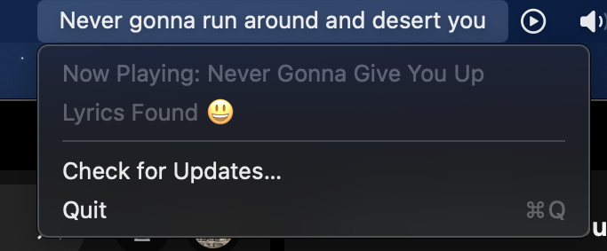

# Spotify Lyrics in Menubar

Live Spotify lyrics in your macOS menubar. It Just Works.

## Downloads

Download from [releases](https://github.com/aviwad/SpotifyLyricsInMenubar/releases).

### Requirements

- macOS Ventura or higher
- Spotify Desktop Client

## Features

- It Just Works.
- Offline caching! Lyrics are automatically stored offline efficiently using CoreData
- Play some music on the Spotify app and watch the lyrics play on the menu bar automatically.

## Screenshots

## Technical Details

- UI is built using SwiftUI.
- The lyrics are updated and fetched using Swift Concurrency and Swift Tasks
- The lyrics are stored into disk using CoreData. 
- I interface with Spotify using their AppleScript methods as well as by subscribing to their playback state change notifications.
- I interface with Spotify's AppleScript methods by using Apple's provided ScriptingBridge interface. 

## Acknowledgements / Special Thanks

- [Sparkle:](https://github.com/sparkle-project/Sparkle) For app updates
- [Amplitude:](https://amplitude.com) For app analytics
- [spotify-lyrics-api:](https://github.com/akashrchandran/spotify-lyrics-api) For fetching Spotify lyrics
- [Spotify:](https://spotify.com) the music platform this project depends on!